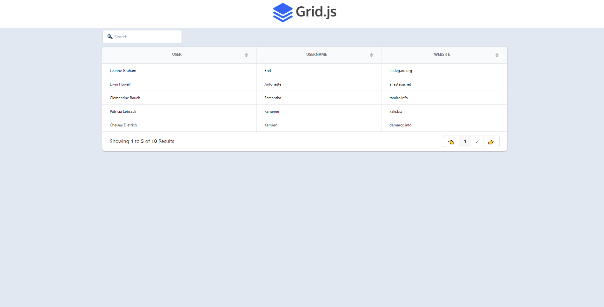
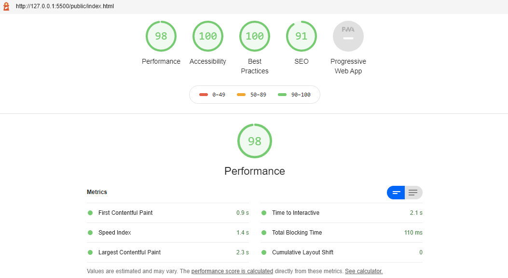

# Grid.js & Tailwind CSS & Webpack Dynamic Table

This is a simple but robust example, using multiple libraries, of how you can develop a dynamic table from a JSON file.

#### Libraries

- [Grid.js](https://gridjs.io/)
- [Tailwind CSS](https://tailwindcss.com/)
- [Webpack](https://webpack.js.org/)
- [JSON Placeholder](https://jsonplaceholder.typicode.com/)

#### Getting started

For developmnet deployment:

`$ npm run dev`

> This will start Webpack-dev-server automatically

For production deployment:

`$npm run prod`

> This will optimize your code for production

#### License

MIT
